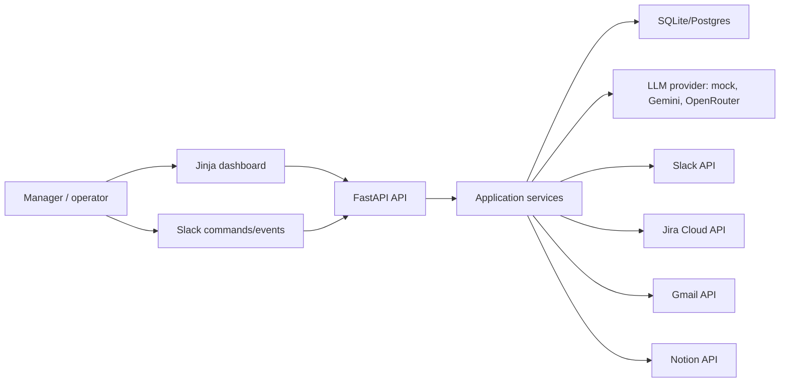
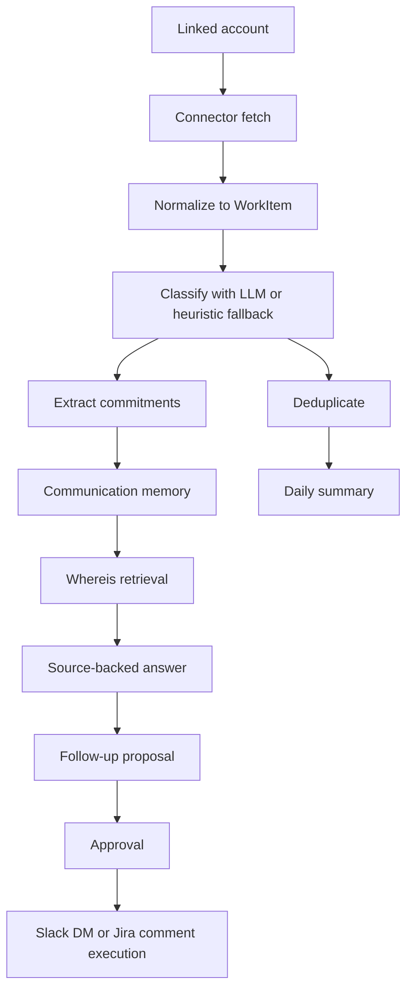

# Communication Loop Tracker HLD

## Purpose

The system is a Slack-first, Jira-aware coordination memory service. It ingests work signals from linked tools, extracts task status and commitments, answers manager questions with citations, drafts follow-ups, captures replies, and keeps Slack/Jira writes behind explicit approval.

## Product Boundary

- Primary workflow: ask "where is person on task", inspect source-backed status, draft follow-up, capture response, optionally draft Jira update.
- Slack and Jira are the pilot-grade connectors.
- Gmail and Notion remain secondary context sources.
- External writes are never executed directly from retrieval or AI output. They must become action proposals first.
- Task-status claims need citations or low confidence.

## System Context

## Major Components

### API And UI

- `app/main.py` wires FastAPI, routers, startup, static files, and metadata creation.
- `app/api/routes.py` exposes health, OAuth callbacks, pipeline runs, communication APIs, Slack ingress, and action approval/execution.
- `app/ui/routes.py` renders the dashboard and connector linking flows.
- `templates/ui_user_detail.html` is the operational dashboard for linked accounts, connector health, task memory, follow-ups, proposals, stale Jira drafts, and audit logs.

### Connector Layer

- `app/connectors/` contains independent read adapters for Gmail, Slack, Notion, and Jira.
- Connectors normalize external API reads into provider-specific raw items.
- Slack supports user lookup for stable Slack IDs.
- Jira supports issue refresh by key for `/whereis` and stale checks.
- Connectors do not perform product writes in the MVP.

### Pipeline And Intelligence

- `DailyWorkPipeline` orchestrates ingestion, normalization, classification, deduplication, commitment extraction, memory update, summary generation, and delivery.
- `NormalizationService` maps raw connector payloads into `WorkItem` records.
- `IntelligenceService` and `LLMService` classify, summarize, and extract commitments.
- `LLM_PROVIDER` supports `mock`, `gemini`, and `openrouter`.

### Communication Memory

- `CommunicationLoopService` owns org/person/task/follow-up memory workflows.
- `RetrievalService` queries structured data first by person, Jira key, task title, project, Slack thread, date range, and commitment status.
- `JiraHygieneService` detects stale Jira-linked task memory and creates draft Jira proposals.

### Approval Boundary

- `ActionProposalService` is the write trust boundary.
- Slack DMs and Jira comments are stored as proposals with citations and payload preview.
- Proposals must be approved before execution.
- Execution writes audit records and stores external URLs or errors.

## Data Stores

The app uses SQLAlchemy models with SQLite locally and Postgres compatibility for production:

- Account data: `users`, `linked_accounts`
- Raw work memory: `work_items`, legacy memory tables
- Communication memory: `organizations`, `people`, `tasks`, `task_sources`, `commitments`, `follow_ups`, `task_status_snapshots`, `memory_events`
- Approval and audit: `action_proposals`, `audit_logs`
- Summaries: `daily_summaries`

## High-Level Data Flow

## Deployment Shape

- API/UI process: FastAPI via Uvicorn.
- Background work: Celery worker and Celery Beat for scheduled summaries.
- Cache/queue: Redis.
- Database: SQLite for local/dev tests, Postgres for production.
- Runtime settings: environment variables via `app/config.py`.

## Security And Trust Decisions

- OAuth tokens are encrypted when `TOKEN_ENCRYPTION_KEY` is set.
- Slack request signatures are verified when `SLACK_SIGNING_SECRET` is configured.
- Refresh tokens are used for expiring OAuth providers and force reconnect when refresh fails.
- External writes require human approval.
- Logs should include IDs, counts, and status, not OAuth tokens or provider secrets.

## Known Next Work

- Add production migrations.
- Add broader tenant isolation tests.
- Add rate limits for webhook endpoints.
- Add per-account background incremental sync jobs.
- Add better observability with request IDs and job IDs.
