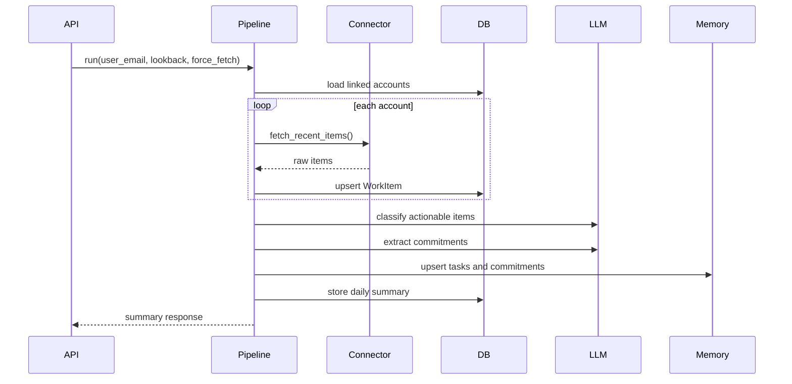

# Communication Loop Tracker LLD

## Runtime Entry Points

| Path | Responsibility |
| --- | --- |
| `app/main.py` | FastAPI app creation, routers, static files, DB table creation |
| `app/api/routes.py` | JSON APIs, OAuth callbacks, Slack command/event ingress, approvals |
| `app/ui/routes.py` | Dashboard, connector linking UI, connector health calculation |
| `app/workers/tasks.py` | Scheduled daily summary execution |
| `app/workers/celery_app.py` | Celery app and beat schedule |

## Configuration

Settings live in `app/config.py`.

Core settings:

- App: `APP_ENV`, `APP_HOST`, `APP_PORT`, `SECRET_KEY`
- DB/queue: `DATABASE_URL`, `REDIS_URL`
- LLM: `LLM_PROVIDER`, `LLM_MODEL`, `LLM_API_KEY`, `GEMINI_API_KEY`, `OPENROUTER_API_KEY`
- OAuth: Google, Slack, Notion, Jira client IDs, secrets, and redirect URIs
- Security: `TOKEN_ENCRYPTION_KEY`, `SLACK_SIGNING_SECRET`
- Product defaults: `DEFAULT_USER_EMAIL`, `JIRA_STALE_DAYS`

## Package Responsibilities

### `app/connectors`

Connectors fetch external data and return raw item dictionaries.

- `base.py`: shared HTTP request, token decrypt, sample-data switch.
- `gmail.py`: Gmail message reads.
- `slack.py`: Slack conversation reads and user lookup.
- `notion.py`: Notion database/page reads.
- `jira.py`: Jira JQL search and issue-by-key refresh.

Connector rule: reads belong here; external writes do not.

### `app/services`

Service layer owns business behavior.

- `account.py`: user/account creation, token encryption, owner metadata.
- `oauth.py`: provider authorization URLs, token exchange, refresh, account identity metadata.
- `ingestion.py`: token refresh, connector dispatch, raw item persistence.
- `normalization.py`: raw item to `WorkItem`, issue-key extraction, people normalization.
- `intelligence.py`: classification orchestration.
- `commitments.py`: LLM extraction validation and storage handoff.
- `communication.py`: org/person/task/follow-up memory workflows.
- `retrieval.py`: structured retrieval and citation assembly.
- `search.py`: cheap lexical fallback index after structured retrieval misses.
- `actions.py`: proposal creation, approval, Slack DM execution, Jira comment execution.
- `authorization.py`: hierarchy and approval permission checks.
- `admin.py`: invitations, onboarding, member listing, reporting-line setup.
- `jira_hygiene.py`: stale Jira detection and draft proposal creation.
- `summary.py`: daily summary payload and rendering.
- `notification.py`: delivery path.

### `app/llm`

- `service.py`: provider abstraction for JSON completions.
- `prompts.py`: classification, summary, and commitment prompts.

Provider behavior:

- `mock`: deterministic local/test fallback.
- `gemini`: Google `generateContent` with JSON response MIME type.
- `openrouter`: OpenAI-compatible chat completions endpoint, defaulting to `google/gemma-4-26b-a4b-it:free` unless a real OpenRouter model ID is set.

## Database Model Groups

### Identity And Accounts

- `User`: product user.
- `UserInvitation`: invite token, desired role, manager, status, and acceptance time.
- `LinkedAccount`: provider account, tokens, metadata, active flag, fetch timestamps.

Provider metadata expectations:

- Slack: `team_id`, `team_name`, `user_id`, `authed_user_id`, `bot_user_id`
- Jira: `cloud_id`, `site_url`, `base_url`
- Notion: `database_ids`

### Raw Work Data

- `WorkItem`: normalized source item.
- Legacy memory tables: `KnownEntity`, `TrackedTask`
- `DailySummary`: persisted daily summary.

### Communication Memory

- `Organization`, `OrganizationMember`
- `Person`: human identity plus optional `manager_person_id` for hierarchy checks.
- `CommunicationTask`
- `TaskSource`
- `Commitment`, `CommitmentParticipant`
- `FollowUp`, `FollowUpMessage`
- `TaskStatusSnapshot`
- `MemoryEvent`
- `SearchDocument`: lexical fallback index for task/work-item lookup. Embeddings remain a later fallback, not the first search store.

### Approval And Audit

- `ActionProposal`: pending/approved/executed/failed proposal, original draft payload, and rejection metadata.
- `AuditLog`: proposal, Slack event dedupe, and execution audit trail.

## Main Flows

### Pipeline Run



Failure handling:

- Expired tokens refresh before fetch.
- A 401 triggers one forced refresh and retry.
- Missing/failed refresh raises `AccountAuthError`.
- LLM failure falls back to heuristics where supported.

### Whereis Query

```mermaid
sequenceDiagram
  participant Caller
  participant API
  participant Loop
  participant Jira
  participant Retrieval
  participant DB

  Caller->>API: POST /communication/whereis
  API->>Loop: answer_whereis(person, task)
  alt task contains Jira key
    Loop->>Jira: fetch_issue_by_key()
    Jira-->>Loop: normalized Jira item
    Loop->>DB: upsert WorkItem and task memory
  end
  Loop->>Retrieval: retrieve structured context
  Retrieval->>DB: tasks, commitments, snapshots, items
  Retrieval-->>Loop: context + citations
  Loop-->>API: status answer + confidence + citations
```

Important merge rule:

- A Jira refresh must not overwrite a newer Slack follow-up reply. Older Jira data can add citations, but it cannot replace fresher human context.

### Follow-Up Creation

```mermaid
sequenceDiagram
  participant Caller
  participant Loop
  participant Slack
  participant Actions
  participant DB

  Caller->>Loop: create_follow_up(@person, task, question)
  Loop->>Slack: resolve_user()
  Slack-->>Loop: stable Slack user ID
  Loop->>Loop: answer_whereis()
  Loop->>DB: create FollowUp and outbound message
  Loop->>Actions: create slack_dm proposal
  Actions->>DB: store ActionProposal and AuditLog
```

Output:

- `FollowUp`
- outbound `FollowUpMessage`
- `ActionProposal` with `target_slack_user_id`, text, `follow_up_id`, citations

### Follow-Up Reply Capture

Entry points:

- `POST /api/v1/communication/followups/reply`
- `POST /api/v1/slack/events`

Slack event handling:

- Verify signature when `SLACK_SIGNING_SECRET` exists.
- Deduplicate by `event_id`; fallback to `channel:ts`.
- Capture only IM message events as follow-up replies.

DB effects:

- Adds inbound `FollowUpMessage`.
- Marks `FollowUp.status = responded`.
- Updates task latest status.
- Appends Slack reply citation.
- Records task snapshot and memory event.

### Jira Update Draft And Execution

```mermaid
sequenceDiagram
  participant Caller
  participant Loop
  participant Actions
  participant Jira
  participant DB

  Caller->>Loop: draft_jira_update_from_follow_up()
  Loop->>Actions: create jira_update proposal
  Actions->>DB: pending_approval
  Caller->>Actions: approve(execute=true)
  Actions->>Jira: POST issue comment
  Jira-->>Actions: comment URL
  Actions->>DB: executed, external_url, audit log
```

Guardrails:

- Draft requires linked Jira ticket.
- Draft requires captured human reply.
- Execution requires approved proposal.
- MVP supports only Jira comment writes.

## API Surface

Core API routes:

- `GET /api/v1/health`
- `POST /api/v1/accounts`
- `GET /api/v1/accounts/{user_email}`
- `GET|POST /api/v1/oauth/{provider}/callback`
- `POST /api/v1/pipeline/run`
- `POST /api/v1/communication/whereis`
- `POST /api/v1/communication/retrieve`
- `POST /api/v1/communication/followups`
- `POST /api/v1/communication/followups/reply`
- `POST /api/v1/communication/followups/{follow_up_id}/draft-jira`
- `POST /api/v1/communication/stale-jira/{user_email}`
- `POST /api/v1/actions/{proposal_id}/approve`
- `POST /api/v1/actions/{proposal_id}/reject`
- `POST /api/v1/actions/{proposal_id}/cancel`
- `POST /api/v1/actions/{proposal_id}/edit`
- `POST /api/v1/actions/{proposal_id}/execute`
- `POST /api/v1/slack/commands`
- `POST /api/v1/slack/events`
- `POST /api/v1/slack/interactions`

UI routes:

- `GET /ui`
- `GET /ui/dashboard`
- `GET /ui/admin`
- `POST /ui/admin/invites`
- `GET|POST /onboard/{token}`
- `GET /ui/actions/{proposal_id}`
- `GET /ui/connect/{provider}`
- `POST /ui/connect/notion/token`

## Connector Health Logic

Connector health is calculated in `app/ui/routes.py`.

Inputs:

- `LinkedAccount.is_active`
- `access_token`
- `expires_at`
- `last_fetched_at`
- provider metadata
- `sample_mode`

Statuses:

- `ok`: active, token/sample available, no required metadata issues, fetched at least once.
- `warning`: usable but missing pilot metadata, never fetched, or token expires soon.
- `error`: inactive, missing token for non-sample account, or expired token.

## Testing Strategy

Current tests use SQLite, mock connectors, and mock LLM mode.

Important test files:

- `tests/test_pipeline.py`: end-to-end pipeline, ingestion refresh behavior.
- `tests/test_communication_loop.py`: source-backed memory, follow-ups, Jira drafts, approval gate, tenant isolation.
- `tests/test_connector_hardening.py`: OAuth scopes, Slack user lookup, Slack event dedupe, Jira issue refresh.
- `tests/test_llm_service.py`: OpenRouter request shape and JSON parsing.
- `tests/test_api.py`: API and dashboard smoke coverage.

Required checks:

```bash
.venv/bin/python -m pytest -q
.venv/bin/python -m compileall app tests
```

## Extension Points

- Add GitHub as a new connector by implementing read adapter methods, normalization metadata, and future approval-gated write proposals.
- Add embeddings only as fuzzy fallback after structured retrieval misses.
- Add migrations before pilot deployment.
- Add per-account background sync jobs for incremental fetch.
- Add connector health API if external admin tooling needs machine-readable health state.
